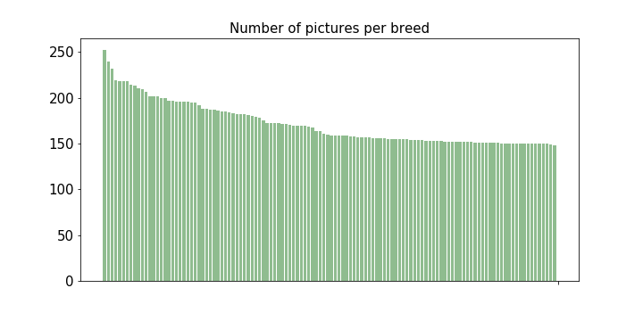
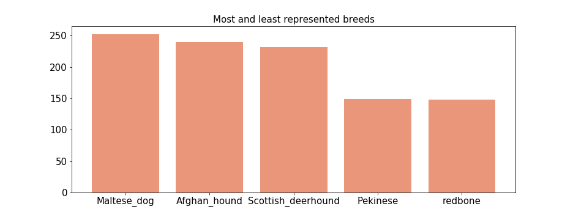
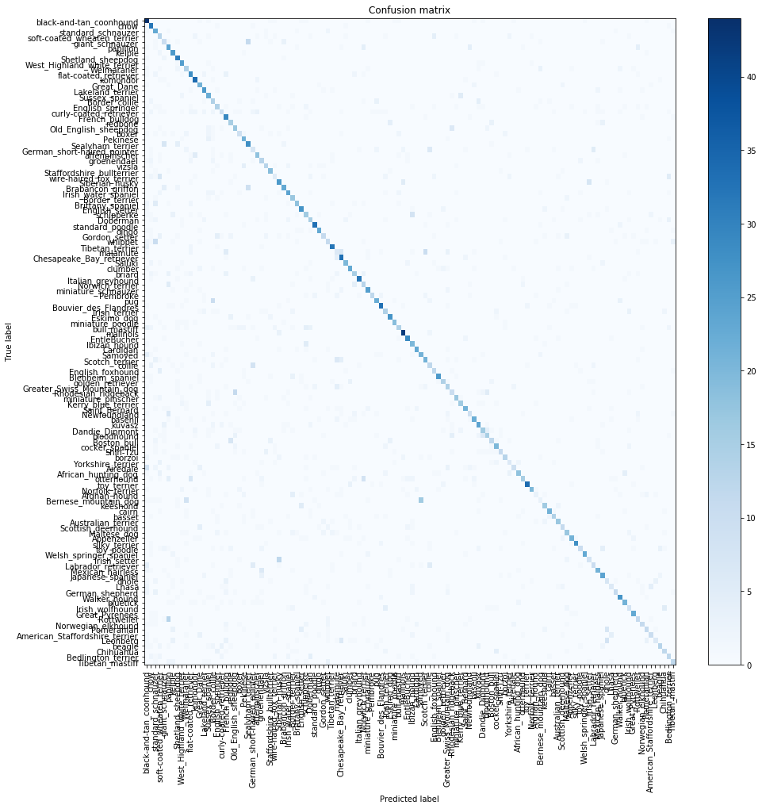
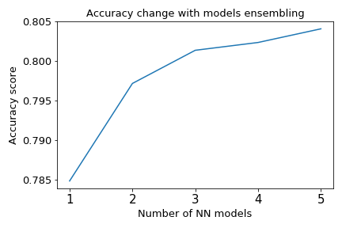
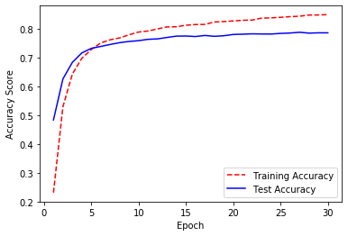
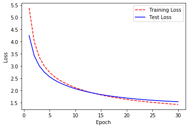
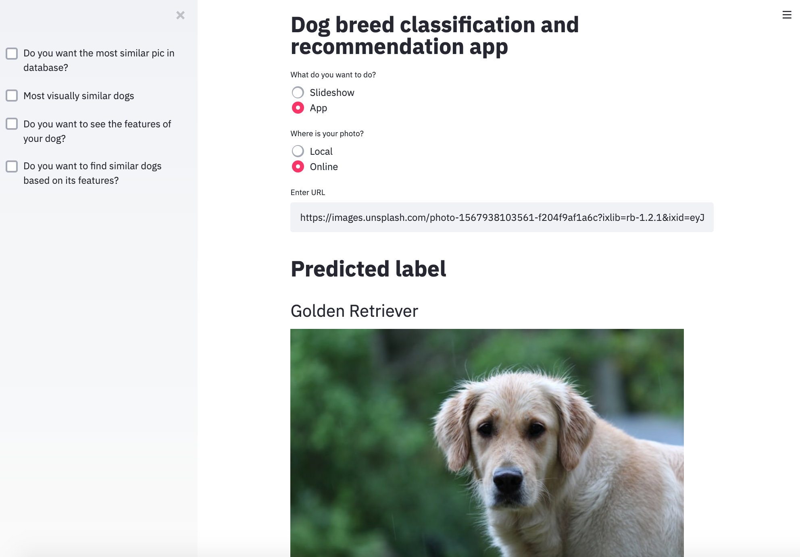

# Dog Breed Classification

#### Classification project for recognition of the dog breed based on a dog image and recommendation system for similar breeds

[Link to detailed presentation on Google Slides](https://docs.google.com/presentation/d/1c-ndVLYt9kpoDejpiDts5CB1A3ZAuwW9MSrfGseukS0/edit?usp=sharing)

Built an app for predicting dog breed based on a dog photo and recommendation system for similar breeds

+ Used an ensemble of neural network models using Keras to predict 1 out of 120 dog breeds
+ Web scraped using Selenium for gathering the dog characteristics
+ Created a dog recommendation engine using cosine similarity of the dog characteristics
+ Used Streamlit library to build an interactive web app

## Project description

Have you ever wondered:

*What is the breed of your neighbors’ dog?*

*Would this dog be the right choice for you?*

*What are the other similar dogs?*

I am a dog person and always find myself petting all my neighbors' dogs. I was always wondering what breed are the dogs I am passing by on the street. To solve this problem, I created a recommender system that takes a photo of a dog, analyze it, desribes what are this dog characteristics and based on it recommend similar breeds. 

Dog images were gathered from open to public Stanford Dogs Dataset and consisted of 20580 pictures of 120 dog breeds.

> Aditya Khosla, Nityananda Jayadevaprakash, Bangpeng Yao and Li Fei-Fei. Novel dataset for Fine-Grained Image Categorization. First Workshop on Fine-Grained Visual Categorization (FGVC), IEEE Conference on Computer Vision and Pattern Recognition (CVPR), 2011.

[Link to dataset](http://vision.stanford.edu/aditya86/ImageNetDogs/)

Dog characteristics were web scraped from PetFinder.com - website of company focused on supporting pet adoption in all North America.

Recommendations are based on cosine similarity of the dog characteristics and images' features.

**Jupyter notebooks summary**:

1. Modeling-dog-breed-classification.ipynb - transfer learning, classification modeling, models ensemble
2. Web-scraping_Dog-similarity.ipynb - web scraping using Selenium, image and characteristics datasets merging, similarity calculations
3. Dog recognition and recommendation app
	- prediction.py + Prediction\_app\_notebook.ipynb - running in jupyter notebook
   - streamlit_script.py - running in Streamlit visualization tool

### Exploratory Data Analysis

Dog images were gathered from open to public Stanford Dogs Dataset which consists of 20580 pictures of 120 dog breeds. On the plot below you can see that distribution of images for all of the breeds was quite uniform.

The Maltese dog, Afgan Hound and Scottish deerhound had the most pictures available and Pekinese and Redbone were the least represented. Even though, models were performing well in distinguishing them among other breeds.

### Classification modeling

In this project I used ResNET-50 model with weights from Imagenet dataset. ResNET-50 is a convolutional neural network model pre-trained on over million images. *Transfer learning* was used to classify dog breeds based on the dog picture - I removed last layer of the ResNET model and used the features from the previous layer (so called bottleneck features) for further classification using other models .

Preprocessing the images was done using Keras built in functions to match the input for ResNET model. All images were normalized using caffe style - centralizing all values.

All images were then run through the model (without the last layer) to extract their features. 2048 bottleneck features extracted from penultimate ResNET model layer were used to predict labels in 120 image classes using different classification algorithms.

First model that I used for classification was Logistic Regression. I divided the whole dataset by 80% for train set and 20% for testing. 

Logistic Regression gave me accuracy metrics at the level of:

*Validation Logistic Regression LogLoss: 0.89*

*Validation Logistic Regression Accuracy: 0.79*

<!---->
 

With this score I was able to predict dog breeds very accurately, but I decided to explore it further with different models.

Next approach was using Random Forest Classifier. With default parameters model was performing much worse than Logistic Regression:

*Validation Random Forest LogLoss: 7.22*

*Validation Random Forest Accuracy: 0.54*

<!---->
 

Grid search run on different Random Forest model hyperparameters resulted that I was able to improve those metrics - LogLoss was at the level of 1.85 and accuracy - 0.73. As it was still lower than Logistic Regression I decided to try using Neural Networks.

After running multiple different architectures of NN I decided to build an ensemble of 5 different models which were performing best. Used hyperparameters:

* 	Optimizer: 3x ‘sgd’, ‘adadelta’, ‘adamax’
* 	Activation function: 2x  ‘relu’, 3x ’tanh’
* 	Number of layers: 7
* 	Loss function: categorical - cross entropy
* 	Regularization: dropout (25%), L2

Example of accuracy and loss history for one of the models:

Accuracy          |  Loss
:-------------------------:|:-------------------------:
 |  

*Validation NN Ensemble LogLoss: 0.73*

*Validation NN Ensemble Accuracy: 0.804*

### Recommendation system

To build a dog recommendation system I needed dog characteristics to compare the different dog breeds and find most similar ones. 

I used Selenium for web scraped the PetFinder.com website. This website belongs to the company focused on supporting pet adoption in all North America and they have informations about physical and behavioral features of hundreds of different pets.

Features of the dogs that I used for comparison are:

* Energy level 
* Exercise requirements
* Playfulness
* Affection level
* Friendliness to other dogs
* Friendliness to other pets
* Friendliness to strangers
* Watchfulness
* Easy training
* Grooming
* Heat sensitive
* Vocality

After gathering the information I had to merge the image recognition system for dog breeds and dog characteristics datasets on breed names to build a recommendation system for similar dog based on its features. Jaro-Winkler text distance was used for better name matching.

The dog recommendation engine was created using cosine similarity of the dog characteristics  - a cosine angle between vectors of all features was calculated for each dog.

At the end I used Streamlit visualization dashboard for building  app for classification and recommendation system.

